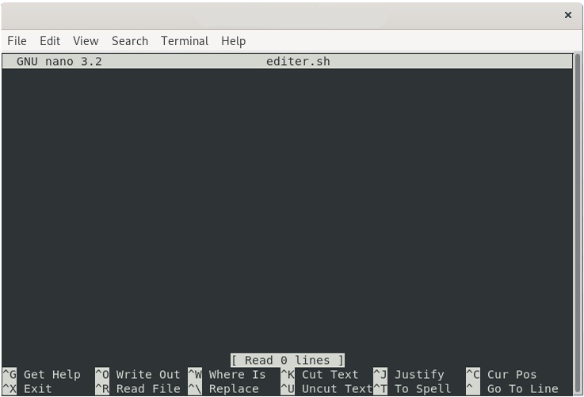
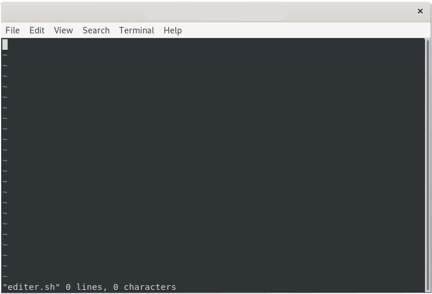

# Editer un fichier

## Editer un fichier avec ``nano``

> La première version de nano a été écrite par Chris Allegretta en 1999, et s’appelait TIP (acronyme récursif de TIP Isn't Pico, « TIP n’est pas Pico »). Son ambition était d’écrire un logiciel libre pour remplacer Pico, car ni Pico ni Pine n’étaient distribués sous une licence libre. [Wikipédia](https://fr.wikipedia.org/wiki/GNU_nano)

On peut éditer un fichier avec la  commande `nano`

Pour ce faire on doit faire comme ceci `nano nomdufichier`

##### Exemple :

On veut éditer un fichier nommé `editer.sh`.

Donc on va dans le répertoire où se trouve le fichier (ou on peut utiliser un chemin absolu tel que `nano Documents/editer.sh`).

On tape la commande :
```bash
$ nano editer.sh
```
Voici ce qui apparait une fois la commande tapée :



C'est tout simplement un éditeur donc on peut écrire ce qu'on (dans le cas d'un fichier ".sh" on veut faire un script).

Comme on peut le voir en bas de la page d'édition, il y a certaines des commandes que l'on peut faire.

**À noter que le symbole "*^*" équivaut à la touche "*Ctrl*"**

Avec la commande ***Ctrl + G***, on peut avoir toutes les commandes qui ne sont pas affiché.

Quelques commandes pratiques :

- ***Ctrl + S*** : pour sauvegarder ce qu'on a fait.

- ***Ctrl + X*** : pour quitter l'édition et retourner dans le terminal.

- ***Ctrl + W*** : pour rechercher dans le fichier.

- ***Ctrl + K*** : couper du texte (pour sélectionner c'est *Shift + flèche* dans la direction que l'on veut sélectionner)

- ***Ctrl + U*** : coller du texte

## Editer un fichier avec `vi`

> vi est un éditeur de texte en mode texte plein écran écrit par Bill Joy en 1976 sur une des premières versions de la distribution Unix BSD.
>Il est présent d'office sur la majorité des systèmes Unix actuels, souvent sous la forme d'un clone du logiciel vi originel. [Linux-France](http://wiki.linux-france.org/wiki/Utilisation_de_vi)

Ici, ça va être un peu plus compliqué car au premier abord ce n'est pas très intuitif.

On va pouvoir éditer notre fichier avec la commande `vi`.

La commande marche pareil que celle de `nano` c'est-à-dire `vi nomdufichier`.

##### Exemple :

On veut éditer le fichier `editer.sh` :

```bash
$ vi editer.sh
```
Voici la fenêtre qui s'ouvre :



`vi` fonctionne differemment de `nano`. En effet il y a 2 modes de fonctionnement avec `vi` :
- le mode **console**, pour y rentrer il faut appuyer sur *ECHAP*
- le mode **insertion**, pour y entrer il faut appuyer sur *i*


