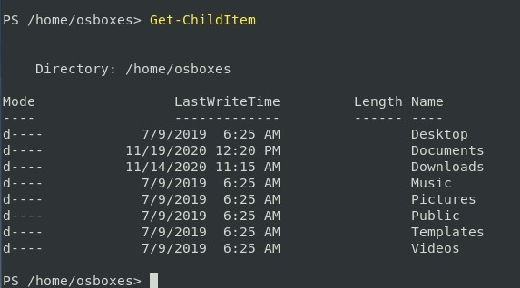
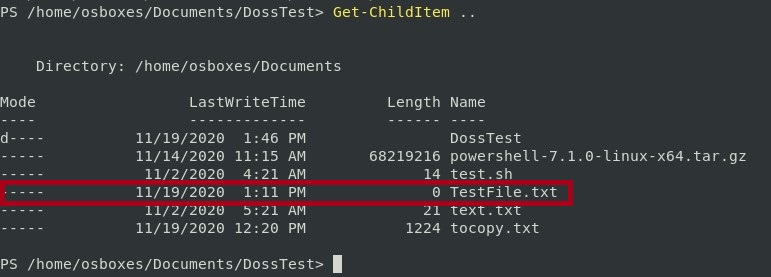

# Installation sur Debian 10

#### Lien : https://docs.microsoft.com/fr-fr/powershell/scripting/install/installing-powershell-core-on-linux?view=powershell-7.1

Ce lien nous donne les commandes et les choses à télécharger pour réussir l'installation du Powershell sur Linux.

### Résoudre le problème avec l'installation

J'ai eu un problème avec l'installation, il ne reconnaissait pas ce qu'on me demandait d'installer.

Pour ce faire, il fallait configurer les sources de APT.

#### Configurer les sources APT:

- Aller dans `\ > etc > apt`
- Editer le fichier `sources.list` avec la commande `sudo nano sources.list`
- (Si jamais une des erreurs est *"please insert the disc labeled"*) il faut enlever la ligne (ou la mettre en commentaire avec le `#`) `deb cdrom:[Debian GNU/Linux etc...`
- Ajouter la ligne suivante `deb http://ftp.fr.debian.org/debian/ sid main`

- Faire la commande `sudo apt update`

### Installation

Maintenant il faut suivre les instruction du [lien ci-joint]( https://docs.microsoft.com/fr-fr/powershell/scripting/install/installing-powershell-core-on-linux?view=powershell-7.1). Il faut se rendre au niveau de l'installation pour **Debian 10**.

--------------

# Qu'est ce que PowerShell + "Fonctionnement"

> "PowerShell est un langage de script fondé sur la programmation orientée objet. Le logiciel PowerShell (fichier exécutable  powershell.exe  ) est l’interpréteur de l’interface en ligne de commande de l’environnement de développement Windows PowerShell." sur [OpenClassrooms]( https://openclassrooms.com/fr/courses/6344196-planifiez-vos-taches-avec-des-scripts-powershell-sur-windows-server/6527315-utilisez-les-commandes-de-base-de-powershell) 

> "Les commandes PowerShell sont constituées d’un verbe ou préfixe et d’un nom, séparés par un tiret. Elles peuvent être suivies de paramètres, on les appelle des commandlets ou cmdlets (command applets en anglais ou phrases en français)." sur [OpenClassrooms]( https://openclassrooms.com/fr/courses/6344196-planifiez-vos-taches-avec-des-scripts-powershell-sur-windows-server/6527315-utilisez-les-commandes-de-base-de-powershell) 

### :bulb: Provenant de [OpenClassrooms]( https://openclassrooms.com/fr/courses/6344196-planifiez-vos-taches-avec-des-scripts-powershell-sur-windows-server/6527315-utilisez-les-commandes-de-base-de-powershell)

Le préfixe de **cmdlet** est appelé verbe car il détermine l’action à effectuer sur les entités désignées dans la phrase. Quelques-uns des plus utiles :

- `Add`  permet d’ajouter des données ou informations sur le nom qui le suit

- `Get`  permet d’obtenir des données ou informations sur le nom qui le suit

- `Read`  permet de lire des données ou informations sur le nom qui le suit

- `Clear`  permet de réinitialiser l’affichage de l’interface 

- `Import` et `Export`  permettent d’importer/exporter des fichiers de commande ou des Alias

- `New`  permet de créer de nouveaux objets ou variables

- `Set`  permet de définir des données ou informations sur le nom qui le suit

- `Write`  permet d’écrire des données ou informations sur le nom qui le suit et peut agir comme le compte rendu d’une commande.


Egalement une autre possibilité de PowerShell : c’est la saisie de valeurs numériques. En voici **quelques-unes** :

- `[string]`: chaîne de caractères.

- `[char]`  : caractère Unicode sur 16 bits.

- `[byte]`  : caractère sur 8 bits non signé.

- `[int]`  : valeur entière sur 32 bits signée.

- `[long]`  : valeur entière sur 64 bits signée.

- `[bool]`  : valeur booléenne (True/False).

- Etc...

```powershell
PS /home/user> [byte] 254
254
```

-------------

# Premières commandes PowerShell

- `Get-Help nomdelacommande` permet d’avoir des informations sur une commande

  **Exemple:** 
  
  `Get-Help Read-Host` ouvrira un "menu" dans lequel on aura des informations sur la commande `Read-Host`
  
- `Read-Host` permet de récupérer des informations (que l'utilisateur pourra rentrer directement dans la console).
*Fonction qui permet de saisir une chaîne de caractères et de l’enregistrer dans une variable*

  **Exemple:**
  
  
  
  `$val` est une variable.
  
  On lui assigne une valeur qui est une chaine de caractère que l'utilisateur va rentrer.
  
  Pour ce faire, on utilise la commande `Read-Host` (avec lequel on peut rajouter une *"phrase d'introduction"*)

  A la suite de ça, on peut entrer la valeur de la chaine de caractère que l'on veut mettre dans `$val`.

  Les dernières lignes permettent de vérifier que `$val` a bien la valeur entrée précédemment.

- `Get-Location` permet de savoir où l'on se trouve.

  **Exemple:**

  ```powershell
  PS /home/user> Get-Location

  Path
  ----
  /home/user

  PS /home/user>
  ```

- `Get-ChildItem` permet d'afficher le contenu d'un dossier.

  **Exemple:**

  

  Comme on peut le voir, la commande affiche bien l'intégralité du contenu du dossier (ici le dossier *Utilisateur*)

- `New-Item` permet de créer un nouvel élément (Dossier ou Fichier)

  **Exemple:**
  - Pour créer un dossier, il faut faire la commande `New-Item Name "NomduDoss" -ItemType Directory`

    Résultat:
    

  - Pour créer un fichier, il faut faire la commande `New-Item Name "NomduFichier" -ItemType File`

    Résulat:
    

  En effet, il faut juste changer le `-ItemType` soit en `Directory` pour un **Dossier** soit en `File` pour un **Fichier**.
  On peut aussi spécifier un chemin au lieu de donner un simple nom au fichier (exemple: `New-Item /home/osboxes/Documents/DossTest/TestFiles.txt`).

  En rajoutant `-Value "Le texte qu'on veut ajouter au fichier"` on peut ajouter du texte au point *.txt*

  Pour visualiser le contenu du fichier texte, tapez la commande suivante (sur Windows ayant le notepad):

  ```powershell
  PS C:\Users\Administrateur> notepad.exe TestFiles.txt
  ```

  Pour Debian 10:

  ```powershell
  PS /home/user> gedit TestFiles.txt
  ```

- `Copy-Item` permet de copier un fichier ou un dossier dans un autre endroit (et même possiblement une copie renommée du fichier)
  
  **Exemple:**

  

  Ici on copie le fichier *TestFile.txt* (assigner par `-Path TextFile.txt`) dans le dossier précédent *Documents* (assigner par `-Destination ..`) 

  

  Je vérifie que la copie c'est effectuée dans le bon dossier.

- (à suivre...)


