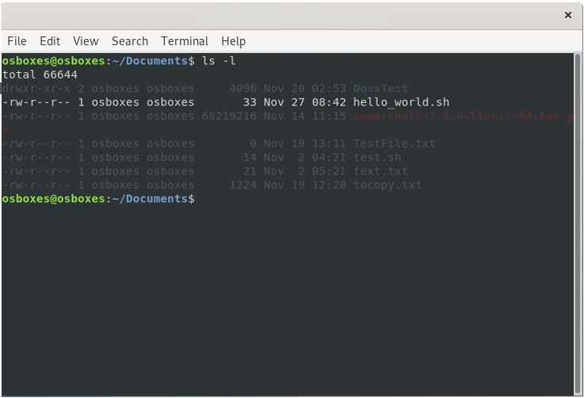

# Premier Script

###### On utilisera la distribution **Debian 10** pour faire notre cours. Ainsi, nous utiliserons le shell **bash**.

-------

### Hello World

Pour commencer, créons un fichier *hello_world.sh* et éditons-le.

```bash
$ touch hello_world.sh
$ nano hello_world.sh
```
J'utilise la commande `touch` pour **créer** le fichier et `nano` pour pouvoir **éditer** le fichier (On aurait pu aussi utiliser la commande `vi` pour éditer). 

Voici la fenêtre qui apparait :


On peut donc écrire le code de *Hello World* :

```bash
#!/bin/bash

echo "Hello World" #va écrire "Hello World!" dans la console
```
Maintenant que notre script est écrit, on peut l'executer.
Afin d'executer un programme il faut faire comme ceci :
```bash
$ ./hello_world.sh
```
Mais malheureusement :

```bash
$ ./hello_world.sh
bash: ./hello_world.sh: Permission denied
$
```
En effet, si on fait la commande `ls -l` on peut voir ceci :



La ligne qui nous interesse est celle en surbrillance c'est-à-dire la ligne du hello_world.sh.

Comme on peut le voir, il y a écrit `-rw-r--r--`. Cela correspond au droit que l'on possède sur le fichier.

Comme on a pu le voir sur le passage sur les droits des fichiers:

- ***r*** : pour *Read* (=Lire). Correspond au droit de lecture.
- ***w*** : pour *Write* (=Ecrire). Correspond au droit d'écriture.
- ***x*** : pour *Execute* (=Executé). Correspond au droit d'execution.

Donc si on veut avoir les droits d'execution, on peut faire:

- `chmod +x hello_world.sh` 
- `chmod 755 hello_world.sh`

Les 2 manières commandes la même chose. C'est-à-dire **tous les droits** à l'**utilisateur propriétaire** et seulement le droit de **lecture** et d'**execution** pour le **reste des utilisateurs** et le groupe concerné. Ce qui donnera ceci `-rwxr-xr-x`.

Voici le résultat du script:

```bash
$ ./hello_world.sh
Hello World!
$
```